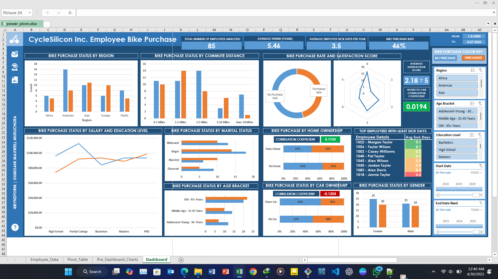

# 🚲 CycleSilicon Inc. Employee Bike Purchase Dashboard – Part 2  
### Advanced PivotTables, Power Pivot, DAX & Dashboard Design  
**By Dumisani Maxwell Mukuchura**

## Dataset Information
- **Source**: Synthetic dataset created in-house by AI
- **Records**: 85 employees after cleaning (originally 100)
- **Author**: Dumisani Maxwell Mukuchura
- **Contact**: 
  - Email: [dumisanimukuchura@gmail.com](mailto:dumisanimukuchura@gmail.com)
  - LinkedIn: [Dumisani Maxwell Mukuchura](https://www.linkedin.com/in/dumisani-maxwell-mukuchura-4859b7170/)
  - GitHub: [dumisanimukuchura](https://github.com/dumisanimukuchura)

  ## Data Dictionary
| Column Name         | Description                              |
|---------------------|----------------------------------------- |
| Employee ID         | Unique numeric identifier                |
| First Name          | Employee's given name                    |
| Last Name           | Employee's family name                   |
| Personal Email      | Employee personal email address          |
| Age                 | Employee age in years                    |
| Gender              | Male/Female                              |
| Marital Status      | Single, Married, Divorced, Widowed       |
| Job Title           | Employee's role/occupation               |
| Annual Salary       | Annual salary in USD                     |
| Education Level     | Highest education completed              |
| Home Owner          | Y/N home ownership indicator             |
| Car Owner           | Y/N car ownership indicator              |
| Commute Distance    | Home-to-work distance categories         |
| Start Date          | Date employee joined company             |
| End Date            | Date left or "Present" if still employed |
| Region              | Geographic region                        |
| Bike Purchase       | Y/N purchased company bike               |
| Bike Satisfaction   | Satisfaction score (1-5 scale)           |

---

## 📘 Project Overview  
Building on Part 1’s cleaned dataset, this phase delivers an **interactive Excel dashboard** showcasing:  
- Advanced **PivotTables** and **Power Pivot** data modeling  
- **DAX** measures & calculated columns  
- Dynamic **slicers**, **timelines**, and **calculated fields**  
- A variety of **chart types** for deep, actionable insights  
- Robust data practices (binning, normalization, reproducibility)

_All work is done in Excel 2019 with Power Pivot enabled, using a fixed “today” date for reproducibility._

---

## 🛠️ Skills & Techniques Explored  
- **Power Pivot / Data Model**  
  - Managing relationships (1:Many via Employee ID)  
  - Calculated columns (`EndDate_Fixed`, `WorkingDays`, `CompanyLevel`)  
  - DAX measures (`Average Tenure`, `Avg SickDays/Yr`, `BikePurchaseRate`, correlation)  
- **PivotTables & Calculated Fields**  
  - `% of Row Total`, `RankX`, conditional filters (Top 5/Bottom 5)  
  - Value field settings (Sum, Max, Average) to preserve pre-calculated values  
- **Dashboard Design**  
  - KPI cards, color‐coded themes, intuitive layout  
  - Slicers (Region, Age Bracket, Education) & Timelines (Start/End Date)  
- **Data Preparation**  
  - **Binning** Age into ranges (21–30, 31–45, 46–65)  
  - **Normalizing** SickDays per Year to offset tenure differences  
  - Handling “Present” in End Date via `IF(...="Present", DATE(2025,4,27), DATEVALUE(...))`

---

## 📈 Dashboard Sections & Visuals  

### 1. **Key Metrics (Top Row)**  
- **Total Employees Analyzed**: `=COUNT([Employee ID])`  
- **Average Tenure (Years)**:  
  ```dax
  AverageTenure :=
  AVERAGE('Clean_Data'[WorkingDays] / 365)
  
- **Avg Sick Days / Year** 

- **Bike Purchase Rate**

- **Bike Purchase Rate:** `HomeCarCorr :=
CORREL(
  IF('Clean_Data'[Home Owner]="Y",1,0),
  IF('Clean_Data'[Car Owner]="Y",1,0)
)` 

### 2. **Bike Purchase Breakdown**

- By Region (Clustered Column)
- By Commute Distance (Clustered Column)
- By Salary & Education (Line with Markers combination)
- By Marital Status (Horizontal Bar)
- By Age Bracket (Stacked Bar)
- By Home Ownership (Stacked Bar + Corr)
- By Car Ownership (Stacked Bar + Corr)
- By Gender (Column)

## 📊 Dashboard Overview

The following dashboard summarizes key insights from the employee bike purchase analysis using Pivot Tables and Charts in Excel.




## 🔍 Key Findings

- **Regional Trends**: Europe & Asia lead in bike adoption; Pacific & Africa lag.
- **Commute Sweet‐Spot**: 1–2 miles commuters purchase most bikes; >10 miles purchase least.
- **Income vs. Education**: High School & Partial College riders earn less; no linear salary tie.
- **Marital Status**: Single & Married ride more; Divorced least, Widowed notable adopters.
- **Home & Car Ownership**: Homeowners (+0.17 corr) ride more; Car owners ride less (–0.12 corr).
- **Age Patterns**: 45+ group rides most, 21–30 group rides least — possible lifestyle factors.
- **Gender Parity**: Nearly equal adoption (20 F vs 19 M).
- **Overall Adoption**: 46% of employees purchased a bike.
- **Health Link**: Top healthiest employees (least sick days) overlap heavily with bike purchasers.
- **Satisfaction**: Average bike satisfaction score is **2.18 / 5**.

---

## 📑 Data Practices & “Why”

- **Binning Age** into 3 ranges avoids a cluttered, sparse scatter of individual ages.
- **Normalizing Sick Days** to a per-year basis ensures fair cross-employee comparisons.
- **Fixed Today Date** (`DATE(2025,4,27)`) preserves reproducibility in “Present” handling.
- **Calculated Columns vs. Measures**:
  - *Columns*: Used for per-row values (e.g., `WorkingDays`, `Home Owner Status Binary` , `Car Owner Status Binary`)
  - *Measures*: Used for dynamic aggregations and context‐aware calculations (e.g., `Avg Sick Days/Year`, `Bike Purchase Rate`)
